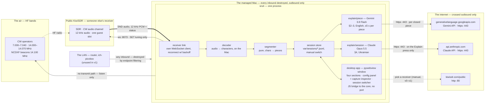

# Architecture — sruti

## Overview



The full annotated diagram — every port, every perimeter, the guards on each crossing — is
[diagrams/ports-and-perimeters.html](diagrams/ports-and-perimeters.html); open it locally in a browser.

One process, one receiver, one frequency at a time. Data flows one way — audio → characters → pieces →
explanations — every step is appended to the session store, and the app's window renders what the core
emits. Nothing in sruti listens on any port.

## Core and the desktop app

The core is UI-agnostic. Components talk through an in-process **event stream** (an asyncio queue): the
receiver emits audio blocks, the signal level, link states and the raw messages; the decoder emits
characters and its status; the segmenter emits pieces; the explainers emit explanations; the store persists everything it sees. The interface
subscribes to the stream and sends back a small, fixed set of **commands**: `tune` (frequency in kHz,
required; receiver optional, defaulting to the current one — tuning is what switches the session),
`start`/`stop`, `explain` (the section-4 button), `open-session`, `rename-session`, `set-config`.

**The interface is a desktop app** — a native macOS window opened by
[pywebview](https://pywebview.flowrl.com) on the system WebKit, launched with `uv run sruti app`:

- **The page** is one HTML file with inline CSS and JavaScript — no build step, no external resources,
  light and dark themes from the system setting. It is handed to the window as a string, so no HTTP
  server is started. Its visual design comes from Claude Design against
  [design/BRIEF.md](design/BRIEF.md), which also fixes the page's event and command names.
- **The bridge** is pywebview's JS bridge. The page calls the core commands as
  `window.pywebview.api.<command>(…)`; Python pushes each core event into the page with `evaluate_js`.
  This is the only channel between the window and the core: **no socket, no port, not even on
  loopback**.
- **What the window shows:** the four sections (§The four sections) in a 2×2 grid; a header with the
  session name (click to rename), receiver, frequency, link status and the running costs; New session
  (asks for a frequency, the receiver optional); the session switcher and the config panel with the
  capture inspector as side panels.
- **Headless mode** (`sruti listen --receiver <host:port> --freq <kHz> [--record <dir>] [--raw]`) runs the
  same core in the terminal, before the app exists and for debugging. From v1.1 it prints the link states
  and the signal level every 10 s; `--raw` adds every raw message in both directions, and `--record`
  writes the session as WAV + capture (§The receiver, the v0.1 format), named `<started>-<receiver>-<freq>`.
  The decoded characters join the output in v1.2.

Everything below the window — receiver, decoder, segmenter, store, explainers, glossary — never imports the app's
code. The window is a shell over the core: new behavior goes into the core, not into the page.

## Components

1. **Receiver link (`receiver`).** Connects to the chosen KiwiSDR the way its browser page does, opens one
   audio channel in CW mode at the chosen frequency and emits the uncompressed 12 kHz audio in blocks with
   timestamps, plus the signal level. Reconnects with backoff; "receiver busy", "all free channels taken"
   and "time limit reached" are states, not crashes. sruti's own small WebSocket client (§The receiver),
   not `kiwiclient`. Also emits the **raw messages** as events, so the config panel's capture inspector can
   show exactly what arrives from the receiver.
2. **Decoder (`decoder`).** sruti's own CW decoder: audio → characters with timestamps, prosigns as strings,
   unknown codes as `[err]`, plus its status (tone, speed, signal over noise). §The decoder.
3. **Segmenter (`segmenter`).** Pure logic: characters → pieces (§Pieces and sessions). It does not cut
   sessions; sessions are manual.
4. **Session store (`store`).** One JSONL file per session under `var/sessions/`, append-only: a `session`
   header (auto name, renameable), then every character, piece and explanation with timestamps. The source
   of replays, test fixtures and new golden examples. Lists saved sessions by name and replays one into
   the event stream, read-only.
5. **Glossary (`glossary/`).** Versioned data: Q-codes, prosigns, common abbreviations, per-language CW
   habits (Italian `ET` for "and", `CAMBIO` for "over"), call-sign prefix basics. Rendered **in full**
   into both prompts as part of the stable prefix — it is compact (a few hundred entries, ~2–3K tokens),
   and the stable prefix is exactly what gets cached: the Gemini API can cache it across pieces, the
   Claude API across presses. Model memory is never trusted for expansions — a wrong gloss is fixed by
   editing a data line, and both tiers speak the same terms. A full prefix→country table (CTY-scale,
   thousands of rows) never goes into a prompt: that is a code lookup (ROADMAP §Deferred), its result
   injected per heard call sign.
6. **Piece explainer (`explain/piece`).** Per piece — buffered by the segmenter, never word by word as it
   arrives: instructions + glossary + the session's last raw pieces + the recent section-3 entries + the
   new piece → Gemini 3.8 Flash with a response schema → `{gloss, action, message | rebuilt}`. `gloss`
   maps the raw text token by token (word, abbreviation, Q-code, prosign, call sign → its expansion and
   meaning); `action` is `none` (nothing new — a repeat), `append` (`message`: one natural entry, CW
   repetitions collapsed, nothing invented) or `rebuild` (`rebuilt`: a replacement for the recent
   entries it was shown, marked "⟲" on screen). They fill sections 2 and 3.
7. **Session explainer (`explain/session`).** Only when the user triggers **Explain**: the whole session →
   Claude Opus 5.5 → a full explanation of what is going on, in the style of the reference answer. Never
   on a timer, never automatic. It fills section 4.
8. **Desktop app (`ui/app`).** The pywebview window, its page and the bridge object that exposes the
   core commands. §Core and the desktop app, §The four sections, §Configuration.

## The receiver

**Why KiwiSDR.** websdr.org receivers only work in a browser. KiwiSDR has an open WebSocket protocol, a
maintained Python client ([jks-prv/kiwiclient](https://github.com/jks-prv/kiwiclient)) and a public
directory of about 870 receivers with load, bands and location (`kiwisdr.com/public`). **Verified** from
the Mac: a public KiwiSDR (Heppen, Belgium) connects through the endpoint filtering, and audio arrives as
12 kHz mono 16-bit.

**Reachable receivers.** The Mac's corporate web filter blocks the "dynamic-dns" category, so receivers on
`ddns.net`, `hopto.org` and similar hosts cannot be reached; sruti uses receivers on ordinary domains. The
directory itself is plain HTTP (`kiwisdr.com` serves nothing on port 443).

**No `kiwiclient` in the product.** `kiwiclient` has no license (checked 2026-10-03 at commit `4eb733e`:
no license file, no statement in the README or the code), which legally means all rights reserved. It
serves only the v0.1 spike (`poc/receiver/cw_spike.py`), run from a local checkout in `var/kiwiclient/`
that is never committed. The `receiver` module (v1.1) is sruti's own client for the audio channel,
written from the protocol the v0.1 captures show.

**Connecting like the browser page.** sruti first asks `http://<host>:<port>/VER`, which answers
`{"maj", "min", "ts", "sp"}`; `ts` is the connection timestamp the receiver issues (bit 62 set, the
receiver's "new timestamp space"). The audio channel is then `ws://<host>:<port>/ws/no_wf/<ts>/SND` —
the browser page's path for a page without a waterfall. Some receivers close `kiwiclient`'s older
`/<ts>/SND` path right after `auth` (seen in v0.1 on a v1.902 receiver).

| Direction | Message | Meaning |
|---|---|---|
| → | `SET auth t=kiwi p=` | log in as a public listener (no password) |
| → | `SERVER DE CLIENT sruti SND` | the page's greeting, sent right after `auth` |
| → | `SET ident_user=sruti` | the name the receiver shows for this connection |
| → | `SET mod=cw low_cut=300 high_cut=700 freq=<kHz>` | CW mode at the signal's own frequency; 300–700 Hz is the default passband, a wider one (e.g. 200–2800) tolerates a frequency read off the waterfall |
| → | `SET agc=1 hang=0 thresh=-100 slope=6 decay=1000 manGain=50` | automatic gain, the receiver's defaults |
| → | `SET compression=0` | plain 16-bit samples instead of IMA ADPCM |
| → | `SET AR OK in=<audio_rate> out=44100` | acknowledge the audio rate the receiver announced |
| → | `SET squelch=0 max=0`, `SET genattn=0`, `SET gen=0 mix=-1` | squelch off, the receiver's test generator off |
| → | `SET keepalive` | once a second, or the receiver drops the channel |
| ← | `MSG badp=<0\|1>` | `0`: the channel is ours; `1`: all channels without a password are taken — "receiver busy", retry later |
| ← | `MSG too_busy`, `MSG down`, `MSG redirect` | further refusals the protocol defines (not yet observed): too many listeners, receiver down, try another address |
| ← | `MSG rx_chans`, `chan_no_pwd`, `chan_no_pwd_true`, `max_camp`, `is_local` | channels: total (8 on Trémolat), without a password (6), how many may share ("camp" on) one, whether we are on the receiver's LAN |
| ← | `MSG audio_init`, `audio_rate`, `sample_rate` | the audio: nominal rate (12000) and the measured one (e.g. `11998.9925`), which sizes the WAV and the decoder's clock |
| ← | `MSG version_maj`, `version_min`, `debian_ver`, `model`, `platform`, `hw`, `firmware_sel`, `abyy` | the receiver's identity: software v1.902, OS, board |
| ← | `MSG center_freq`, `bandwidth`, `adc_clk_nom`, `ext_clk`, `freq_offset`, `has_attn`, `rf_attn`, `max_thr` | the RF front end: 0–30 MHz coverage, clock, attenuator |
| ← | `MSG load_cfg`, `load_dxcfg`, `load_dxcomm_cfg`, `cfg_loaded`, `dx_db_name`, `last_community_download` | the receiver's configuration and band-label databases, URL-encoded JSON (20–50 KB each as sent); they carry the owner's contact details and nothing sruti reads |
| ← | `MSG antsw_AntennaDenySwitching` | the antenna-switch extension's state, repeated every few seconds |
| ← | `MSG client_public_ip` | the address the receiver sees for us — masked in captures |
| ← | `SND <binary frame>` | flags (1 byte), sequence (4, little-endian), S-meter (2, big-endian; dBm = 0.1 × value − 127), then the samples: 16-bit big-endian at ~12 kHz when uncompressed |

**Frequency and tone.** In CW mode the receiver takes `freq` as the signal's own frequency and puts it on
a tone near 500 Hz, inside the 300–700 Hz passband. Passing the frequency minus 0.5 kHz — `kiwiclient`'s
passband-centre option — moves the signal to ~1000 Hz, out of the passband: that was the ~1003 Hz tone an
early test heard on the 14.100 MHz beacon, and it silenced v0.1's first recordings. The decoder finds the
tone wherever it lands in the passband, so no exact offset is needed.

**The receiver's own decoder is not used.** KiwiSDR has a CW decoder extension (`CW_decoder`, over a
second, EXT socket). Many receivers do not offer it — the list a receiver sends was empty on one of the
v0.1 receivers — and where it was offered, it attached to sruti's channel but never processed its audio,
not even its own test file. sruti decodes on the Mac instead (§The decoder); the extension stays an
optional second source (ROADMAP §Deferred), and the spike keeps it behind `--kiwi-decoder`.

**The raw capture.** Every text message crossing the socket is written to a JSONL capture, one object per
line: `{"t": <epoch seconds>, "ws": "SND", "dir": "→" | "←", "msg": "<the message exactly as on the
wire>"}`; the owner's address in `MSG client_public_ip` is masked, the configuration
blobs (`load_cfg`, `load_dxcfg`, `load_dxcomm_cfg`) are reduced to their size (`load_cfg=omitted:20947`), binary audio frames and the
once-a-second `SET keepalive` are left out. The audio goes beside it as a WAV file (mono, 16-bit, 12 kHz).
The v0.1 recordings are this pair, and the fake receiver replays them.

**Being a guest.** One connection per run, identified as `sruti`. Public receivers limit slots and session
time; the link reports both and backs off from a busy or full receiver.

## The decoder

sruti's own CW decoder turns the channel's audio into characters (prototype: `poc/receiver/cw_decode.py`,
v0.1; product: v1.2):

1. **Find the tone.** Score every frequency the receiver's filter passes by its loud moments — the 90th
   percentile of its power over short frames — because keyed CW is intermittent. Bins outside the filter
   are ignored: their near-silence would make plain noise look like a tone. A tone counts only if it
   stands at least 6 dB above the rest of the passband; an empty passband yields no text at all.
2. **Follow its envelope.** Mix the tone down to 0 Hz, smooth over 12 ms and take the magnitude every
   5 ms, in dB.
3. **Key on an adaptive threshold.** Over a 4 s window, the threshold sits midway between the noise floor
   (25th percentile) and the signal peak (97th percentile), with ±1 dB of hysteresis. Where peak over floor
   is under 14 dB there is no signal — noise alone spreads about 11 dB.
4. **Measure marks and gaps.** Run lengths of key-down and key-up, with glitches under 10 ms folded into
   their neighbours.
5. **Adapt to the speed.** The dot length is the lower of two clusters of mark lengths (dashes are about
   three dots), re-estimated over the last 24 marks as the sending speed changes, within 5–50 WPM. Noise spikes form a third, much shorter cluster: when the two clusters
   are more than 4.5× apart, the lower one is noise and is dropped. Without this, real recordings read as
   `TTTT…` — every dot and dash longer than the "dot" the spikes suggested.
6. **Read the Morse.** A mark under 0.4 dots is a noise spike and counts as gap; a gap under 0.25 dots
   between two marks is a fade and joins them. Thresholding the envelope lengthens every mark and
   shortens every gap by the same bias *b* (11–15 ms on Trémolat), so the measured dot *dm* and the gap
   inside a character *dg* — the lower cluster of recent gaps — straddle the true unit *u* = (*dm*+*dg*)/2,
   *b* = (*dm*−*dg*)/2. A mark is a dash from 2*u*+*b*; a gap ends a character from 2*u*−*b* and a word
   from 5*u*−*b*. Speed in WPM = 1.2 / *u*. Codes map to characters through the Morse table; prosigns sent together come out as
   `<AR>`, `<SK>`, `<KN>`, `<BT>`; an unknown code is `[err]`, never a guess.

It emits characters with timestamps and its status — tone, speed, signal over noise — as events; the
characters feed the segmenter exactly as before. The prototype's self-test decodes synthetic CW with known
text at 14–28 WPM down to 6 dB SNR — also with the keying bias a real receiver adds — and an empty
passband to nothing, also when searched wider than the filter. On a real recording (Trémolat, 7033.05 kHz, 2026-10-03) it read `CQ POTA DE DJ0YI DJ0YI POTA K`
and the answer from `OK7DA/P` with `RST 5NN`, with errors where the signal faded.

## The four sections

The display contract of the app's window:

| # | Section | Content | Source | When it updates |
|---|---|---|---|---|
| 1 | **Original text** | the decoded characters, as sent | sruti's decoder, from the receiver's audio | live, character by character |
| 2 | **Word by word** | each token of the piece → its expansion and meaning | piece explainer `gloss` (Gemini 3.8 Flash) | when a piece closes |
| 3 | **Message** | what the operator actually said, as a natural message — never a word-for-word echo | piece explainer `message` (Gemini 3.8 Flash) | together with section 2 |
| 4 | **What is going on** | who talks to whom, what kind of exchange, the story so far | session explainer (Claude Opus 5.5) | **only when the user presses Explain** |

The business logic, section by section:

**Section 1 — Original text.** Streams live, character by character, exactly as the decoder emits them:
prosigns as strings, unknown codes as the decoder's `[err]`, nothing cleaned up or guessed. Lulls (a piece
closed by silence, an `SK`) are visible as spacing, not hidden. This section never waits for a model and
never fails: whatever happens to the explainers, the raw text is already on screen and already in the
session store.

**Sections 2 and 3 — Word by word, and the Message.** One piece-tier call per **closed piece** produces
both, and they carry different layers. The gloss is the **literal layer**: *how* the raw text maps to
meaning, token by token, every token covered — words, abbreviations, Q-codes, prosigns, call signs,
repeats and all. The message is the **communicative layer**: what the operator actually said, as one
natural English message — never a word-for-word echo. CW repetition conventions collapse
(`CQ CQ CQ DE IZ4PHG IZ4PHG` → "General call from IZ4PHG"; a report sent twice is stated once), fillers
fold into the sentence, but nothing is added that wasn't sent, and a call sign still appears exactly as
transmitted. Repetition is how CW fights noise; it is transport, not content — the gloss preserves it, the
message drops it.

The update cadence is therefore the piece-cut cadence, never a timer and never per word: a piece closes on
an end-of-turn prosign standing alone, on 3 s of silence, or at 200 characters (all three from
configuration), and the call has 5 s after that. In a lively exchange that means fresh gloss and message
a few seconds after each handover; in unbroken sending, at worst every ~200 characters. If the piece tier
fails or overruns — no key, no network, an error, past 5 s — these two sections simply stay empty for
that piece; section 1 already shows the raw text, and the failure is logged, never shown as a guess.

The whole section never travels to or from the model. Each call carries the glossary, the last raw
pieces (ground truth), **the recent section-3 entries** (what the reader has already been told) and the
new piece, and asks one question: *what, if anything, does this piece add or change for the reader?* The
answer is the gloss block plus **one of three actions**, the model's choice:

- **`none`** — the piece adds nothing (the same CQ call or beacon cycle again): no new line; section 3
  bumps a repeat counter ("×n") on its latest entry.
- **`append`** — one new message entry at the end. A piece that *changes* something arrives this way
  too, as a corrective entry: "correction: the call sign is IU3FEJ, not IU3FE".
- **`rebuild`** — rare, when the new piece reframes what the window already says (two stations turn out
  to be one, the language is identified mid-conversation): a replacement for **exactly the recent
  entries the model was given**, shown as one rewritten block with a visible "⟲ rewritten" mark. The
  model can never touch anything beyond its window; reconciling the *whole* conversation remains the
  session tier's job, on Explain.

Prompts and outputs stay bounded either way, so the 5 s budget stays flat over a long session; whether
the model uses `rebuild` judiciously is measured on the golden examples in v0.2. The gloss (section 2)
appends always — it is the literal layer. The **store stays append-only** regardless of action: every
response is one more explanation record, the screen is only a view of them, and a replay reproduces the
same sequence of appends, counters and rebuilds. Section 4 is the opposite of all this: **rebuilt
wholesale on every press**.

**Section 4 — What is going on.** Updates **only when the user presses Explain**. The press sends the
whole session (all pieces so far) to the session tier and renders the Ukrainian explanation; earlier
content stays visible until the new answer replaces it. While the call runs, the section says so and the
button is disabled (no concurrent calls — a second press waits for the first). A failed or timed-out call
keeps the previous explanation and adds an error note. Without a Claude key the section permanently reads
"Explain off — no Claude key" and the rest of the interface is unaffected. Each press's cost is shown with
the answer and added to the session total. Nothing else — not a session switch, not a reconnect, not
quitting — triggers this section.

**Output languages:** sections 2 and 3 (the piece tier) are in **English**; section 4 (the session tier)
is in **Ukrainian**. Both are configuration (`language.piece = "en"`, `language.session = "uk"` by
default). Call signs, Q-codes and quoted original text stay as sent in every section.

## Pieces and sessions

- A **piece** closes on an end-of-turn prosign standing alone (`K`, `KN`, `BK`, `AR`, `SK`), on 3 s
  without characters, or at 200 characters. The piece is the piece tier's buffer.
- A **session is manual.** On launch, sruti connects with the `sruti.toml` defaults, and that opens the
  first session. It ends only when the user switches or quits. **Switching the session and retuning are
  the same action:** changing frequency or receiver closes the current session file and opens a new one.
  `SK` and long silence close pieces and are shown as lulls, but never end a session on their own.
- **Every session has a name.** On open it is auto-named from its facts — e.g.
  `2026-10-02 21:40 · <receiver> · 14052 kHz` — and the user can rename it at any time from the app, while
  listening or in the switcher ("Italian ragchew", "beacon check"). A rename appends a `session` record
  (the latest name wins); the file is never renamed and nothing is rewritten.
- **Every session is saved** — `var/sessions/<started>-<receiver>-<freq>.jsonl`, append-only. The session
  switcher lists them by name, with receiver, frequency, date and piece count; an opened past session
  replays into the same four sections, read-only.
- The piece thresholds are configuration; these values are starting points, tuned on recorded sessions.

Records — also the session-store lines:

```
session      {session, t, receiver, freq_khz, name}   — first line of the file; appended again on rename, latest wins
char         {session, t, ch}
piece        {session, seq, receiver, freq_khz, wpm, t_start, t_end, cut: prosign|pause|length, raw}
explanation  {session, tier: "piece", piece_seq, model, action: none|append|rebuild, gloss: [[token, meaning], …], message | rebuilt, latency_ms, cost_usd}
explanation  {session, tier: "session", upto_seq, model, text, latency_ms, cost_usd}
```

## The two tiers

| | Piece tier — Gemini 3.8 Flash | Session tier — Claude Opus 5.5 |
|---|---|---|
| When | every closed piece — buffered, never word by word | **only on the user's Explain action**; never on a timer, never automatic |
| Input | the hints glossary (`glossary/cw-hints.md`) + the last 5 raw pieces + the recent section-3 entries + the new piece | the full glossary (`glossary/cw.md`) + the whole session |
| Output | JSON `{gloss, action, message/rebuilt}`, in English → sections 2 and 3 | a full explanation in Ukrainian, reference-answer style → section 4 |
| Where | Gemini API, `generativelanguage.googleapis.com:443` | Claude API, `api.anthropic.com:443` |
| Budget | ≤ 5 s after the piece closes; the running cost is summed per session and shown | ≤ 30 s per press; every call's cost is shown and summed per session |
| When unavailable | the piece shows raw text only (sections 2–3 stay empty for it) | Explain reports the session tier is off; everything else works |

**Piece model.** Gemini 3.8 Flash (`gemini-3.8-flash`) through the Gemini API's `generateContent`, with
structured output against the `{gloss, action, message/rebuilt}` schema (`responseSchema`), thinking level
`low` and the default temperature. The key travels in the `x-goog-api-key` header, never in the URL.
Prices: $0.75 / $3.75 per million input / output tokens through 2026-12-31, $1.50 / $7.50 from 2027-01-01
(thinking tokens bill as output). Measured on the golden examples in v0.2: ~1.45K input and ~0.4K output
tokens per piece (thinking included), 1.5–4.1 s per piece. That is ≈ $0.0026 per piece and about $0.26
per hour of lively traffic (~100 pieces), doubling in 2027. This tier spends automatically, piece by
piece, so its running cost is shown next to the Explain costs.

**The piece prompt (settled in v0.2).** The glossary form is the **hints file**, `glossary/cw-hints.md`
(~2.6K characters): only what models get wrong — decoder damage, misread habits, contest and POTA
conventions, call-sign rules. The model's own knowledge covers standard abbreviations. On the golden
examples it matched the full glossary on quality, at half the input tokens. The full glossary twice
read stray letters as cut numbers (`A` → 1, `T` → 0) where the hints run marked them as fragments
(`poc/RESULTS.md` §v0.2, `poc/eval/`). The system instruction is this text, followed by `HINTS:` and the
hints file verbatim:

```text
You are the piece explainer of sruti, a CW (Morse) listening agent.
You receive decoded CW text from amateur-radio conversations. Decoders drop, split and merge
letters; operators use CW abbreviations, Q-codes and prosigns.

Rules — all of them hard:
- Never invent. Unreadable text is rendered as [...]. A call sign is copied exactly as sent and
  never "corrected" into a different one; never offer a call sign that is not in the text. If two
  readings are possible, say so briefly.
- Use your own knowledge of amateur-radio CW and of the operators' language; translate plain
  words normally. The HINTS below list what models commonly get wrong: follow them. Rebuild a
  damaged word when context makes it clear and say it is a reconstruction; if you are not sure
  of a token, keep it as sent and mark it (?).
- The operators' language may be Italian, German, English etc. Translate MEANING into English.
- gloss: map the raw text token by token (words, abbreviations, Q-codes, prosigns, call signs),
  in order, every token covered. Repeats stay in the gloss.
- message: what the operator actually SAID, as one natural English message. Collapse CW
  repetitions (CQ CQ CQ -> one general call; a doubled call sign -> once). Add nothing. A call sign
  you joined from fragments keeps its (?) in the message too.
- action: "none" if this piece adds nothing new for the reader beyond repeating what the recent
  entries already say; "append" if it adds something (message = the new entry; a correction of an
  earlier entry is also an append, phrased "correction: ..."); "rebuild" ONLY if the new piece
  reframes what the recent entries say (then rebuilt = replacement list for those entries). A rebuild
  that would leave the entries saying the same thing is wrong: that is "none".
```

The user message, per piece (the last 5 raw pieces; the recent section-3 entries, which a `rebuild`
replaces):

```text
PREVIOUS RAW PIECES (ground truth, oldest first):
- <piece>                                  (or "(none — session start)")

RECENT SECTION-3 ENTRIES (what the reader has been told):
1. <entry>                                 (or "(empty)")

NEW PIECE:
<the piece, exactly as decoded>
```

The response schema (`responseSchema`, the OpenAPI subset the Gemini API takes): an object with
`gloss` (array of `{token, meaning}`, required), `action` (`none` | `append` | `rebuild`, required),
`message` (string, nullable) and `rebuilt` (array of strings, nullable), properties in that order.
Thinking level `low`, the default temperature. On the golden examples the model chose `rebuild` in 1–2
of 15 pieces, each time when two copies of one call sign turned out to be one station.

**Session model.** Claude Opus 5.5 (`claude-opus-5-5`, $4 / $20 per million input / output tokens) by
default, at low effort; Claude Fable 5.1 (`claude-fable-5-1`, $10 / $50) by configuration. At an estimated
~3K input and ~1K output tokens per press: Opus ≈ $0.03, Fable ≈ $0.08. The cost is user-controlled —
one press, one call — and displayed per call and per session. Instructions and glossary form a stable
prefix for prompt caching across presses.

## Configuration and the config panel

- **The config file** (`sruti.toml`): receiver `host:port`, frequency, the passband (300–700 Hz, or wider
  for an imprecise frequency), the decoder parameters (tone:
  automatic or fixed Hz; speed: automatic or fixed WPM; the threshold contrast), the client identity (`sruti`),
  the output languages (`language.piece`, `language.session`), the segmenter thresholds, the model names
  and budgets. **`.env` holds the two API keys** — `GEMINI_API_KEY` for the piece tier and
  `ANTHROPIC_API_KEY` for the session tier; no key ever lives in `sruti.toml` or in code.
- **The config panel** (a side panel of the app) edits the connection settings and shows the
  **capture inspector**: the live raw messages exactly as they arrive from the receiver (the `MSG` status
  lines, the audio frames' signal level, and anything unrecognized) next to how sruti parsed each one, and
  the decoder's status (tone, speed, signal over noise) — so it is verifiable what is captured and how,
  before and while listening. Changes are saved to the config file and applied on reconnect.

## Hosts

- **The Mac** (M1 Pro, 32 GB, managed): runs sruti from the repo with `uv`; both models run in the cloud.
  Constraints: no SDR software, inbound connections destroyed by endpoint filtering — which is why nothing
  in sruti listens on any port — outbound HTTPS and WebSocket work, and a corporate web filter blocks
  dynamic-DNS hosts (§The receiver).
- **`ich-picobox`** (Ubuntu 22.04, x86-64, 4 cores, 15 GB, no GPU, on the LAN): not used in v1. A possible
  later home for the receiver link or own SDR hardware.

## Testing

- **Unit** — the decoder on synthetic CW (speeds, noise, fading, an empty passband), audio frame
  unpacking, segmenter rules, glossary rendering, prompt assembly, output-schema
  validation, session-store round-trip and replay, event serialization for the bridge.
- **Fake receiver** — replays the v0.1 recordings (WAV audio + raw capture), so the whole pipeline,
  decoder included, runs without a network.
- **The app, without a window** — the bridge object is driven directly over the fake receiver, with a
  fake window that records every `evaluate_js` call: commands in, events out, in order. No GUI in CI.
- **The page** (opt-in) — rendered in a headless browser from a recorded event snapshot baked into it,
  and checked by screenshot.
- **Models are mocked by default.** No test calls the Gemini API or the Claude API unless asked to.
- **Golden-example eval** (opt-in) — runs a real model over `specification/examples/`, records quality
  notes and latency; the basis of every model and prompt choice.
- **Live check** (opt-in) — the NCDXF/IARU beacons on 14.100 MHz send known call signs at 22 WPM on a
  3-minute cycle: a real signal with a known answer.
